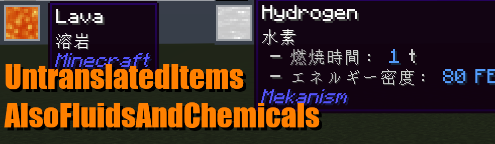

# UntranslatedItems Also Fluids And Chemicals!

[日本語](./README.md) | English

An addon of [UntranslatedItems](https://www.curseforge.com/minecraft/mc-mods/untranslated-items), that also makes fluids
and chemicals from mekanism mod untranslated!

This mod is inspired by [UntranslatedItems-AlsoFluids](https://github.com/KatatsumuriPan/UntranslatedItems-AlsoFluids/).
Great respect for KatatsumuriPan!

## Minecraft versions and external mods support

Currently supported Minecraft/modLoader versions and external mods are as follows.

| Minecraft | modLoader     | supported external mods              |
|-----------|---------------|--------------------------------------|
| 1.20.4    | neoforge      | Mekanism,EMI,Jade,AppliedMekanistics |
| others    | *unsupported* | *unsupported*                        |

If you want other minecraft versions, other modLoader, or other external mods support, please open [issue](./issue).  
(It's hard to support all versions independently, so I'll support the ones in demand.)

## License
This mod is released under LGPL v2.1.  
See also [LICENSE.txt](./LICENSE.txt).
